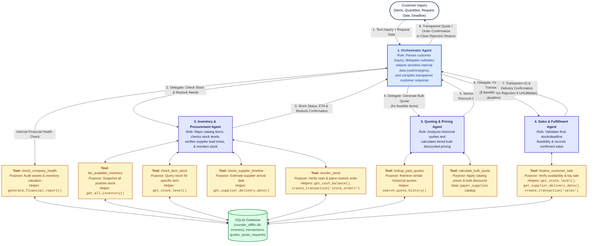

```mermaid
flowchart TD
    %% Styling
    classDef customer fill:#f8fafc,stroke:#334155,stroke-width:2px,color:#0f172a
    classDef orchestrator fill:#dbeafe,stroke:#1d4ed8,stroke-width:2.5px,color:#1e3a8a
    classDef worker fill:#e0e7ff,stroke:#4338ca,stroke-width:2px,color:#1e1b4b
    classDef tool fill:#fef3c7,stroke:#b45309,stroke-width:1.5px,color:#78350f
    classDef db fill:#dcfce7,stroke:#15803d,stroke-width:2px,color:#14532d

    %% External Actor & Database
    Customer(["Customer Inquiry<br/>(Items, Quantities, Request Date, Deadline)"]):::customer
    DB[("SQLite Database<br/>(munder_difflin.db:<br/>inventory, transactions,<br/>quotes, quote_requests)")]:::db

    %% 1. Orchestrator Agent
    Orchestrator["<b>1. Orchestrator Agent</b><br/><i>Role:</i> Parses customer inquiry, delegates subtasks,<br/>redacts sensitive internal data (cash/margins),<br/>and compiles transparent customer response"]:::orchestrator
    T_Health["<b>Tool:</b> check_company_health<br/><i>Purpose:</i> Audit assets & inventory valuation<br/><i>Helper:</i> <code>generate_financial_report()</code>"]:::tool

    %% 2. Inventory & Procurement Agent
    InvAgent["<b>2. Inventory & Procurement Agent</b><br/><i>Role:</i> Maps catalog items, checks stock levels,<br/>verifies supplier lead times, & reorders stock"]:::worker
    T_InvAll["<b>Tool:</b> list_available_inventory<br/><i>Purpose:</i> Snapshot all positive stock<br/><i>Helper:</i> <code>get_all_inventory()</code>"]:::tool
    T_InvItem["<b>Tool:</b> check_item_stock<br/><i>Purpose:</i> Query stock for specific item<br/><i>Helper:</i> <code>get_stock_level()</code>"]:::tool
    T_SupDate["<b>Tool:</b> check_supplier_timeline<br/><i>Purpose:</i> Estimate supplier arrival date<br/><i>Helper:</i> <code>get_supplier_delivery_date()</code>"]:::tool
    T_Reorder["<b>Tool:</b> reorder_stock<br/><i>Purpose:</i> Verify cash & place restock order<br/><i>Helpers:</i> <code>get_cash_balance()</code>,<br/><code>create_transaction('stock_orders')</code>"]:::tool

    %% 3. Quoting & Pricing Agent
    QuoteAgent["<b>3. Quoting & Pricing Agent</b><br/><i>Role:</i> Analyzes historical quotes and<br/>calculates tiered bulk-discounted pricing"]:::worker
    T_Hist["<b>Tool:</b> lookup_past_quotes<br/><i>Purpose:</i> Retrieve similar historical quotes<br/><i>Helper:</i> <code>search_quote_history()</code>"]:::tool
    T_Calc["<b>Tool:</b> calculate_bulk_quote<br/><i>Purpose:</i> Apply catalog prices & bulk discounts<br/><i>Data:</i> <code>paper_supplies</code> catalog"]:::tool

    %% 4. Sales & Fulfillment Agent
    SalesAgent["<b>4. Sales & Fulfillment Agent</b><br/><i>Role:</i> Validates final stock/deadline<br/>feasibility & records confirmed sales"]:::worker
    T_Sale["<b>Tool:</b> finalize_customer_sale<br/><i>Purpose:</i> Verify availability & log sale<br/><i>Helpers:</i> <code>get_stock_level()</code>,<br/><code>get_supplier_delivery_date()</code>,<br/><code>create_transaction('sales')</code>"]:::tool

    %% Customer <-> Orchestrator Flow
    Customer -->|"1. Text Inquiry + Request Date"| Orchestrator
    Orchestrator -->|"8. Transparent Quote / Order Confirmation<br/>or Clear Rejection Reason"| Customer

    %% Orchestrator <-> Health Tool
    Orchestrator <-->|"Internal Financial Health Check"| T_Health
    T_Health <--> DB

    %% Orchestrator <-> Inventory Agent Flow
    Orchestrator -->|"2. Delegate: Check Stock & Restock Needs"| InvAgent
    InvAgent -->|"3. Stock Status, ETA & Restock Confirmation"| Orchestrator

    InvAgent <--> T_InvAll
    InvAgent <--> T_InvItem
    InvAgent <--> T_SupDate
    InvAgent <--> T_Reorder

    T_InvAll <--> DB
    T_InvItem <--> DB
    T_Reorder <--> DB

    %% Orchestrator <-> Quoting Agent Flow
    Orchestrator -->|"4. Delegate: Generate Bulk Quote<br/>(for feasible items)"| QuoteAgent
    QuoteAgent -->|"5. Itemized Quote, Discount & Rationale"| Orchestrator

    QuoteAgent <--> T_Hist
    QuoteAgent <--> T_Calc
    T_Hist <--> DB

    %% Orchestrator <-> Sales Agent Flow
    Orchestrator -->|"6. Delegate: Finalize Order Transaction<br/>(if feasible & within deadline)"| SalesAgent
    SalesAgent -->|"7. Transaction ID & Delivery Confirmation<br/>(or Rejection if Unfulfillable)"| Orchestrator

    SalesAgent <--> T_Sale
    T_Sale <--> DB
```